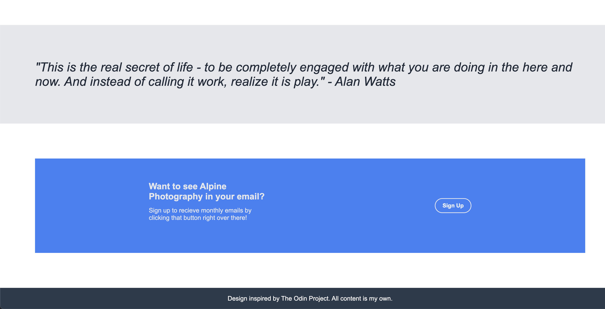
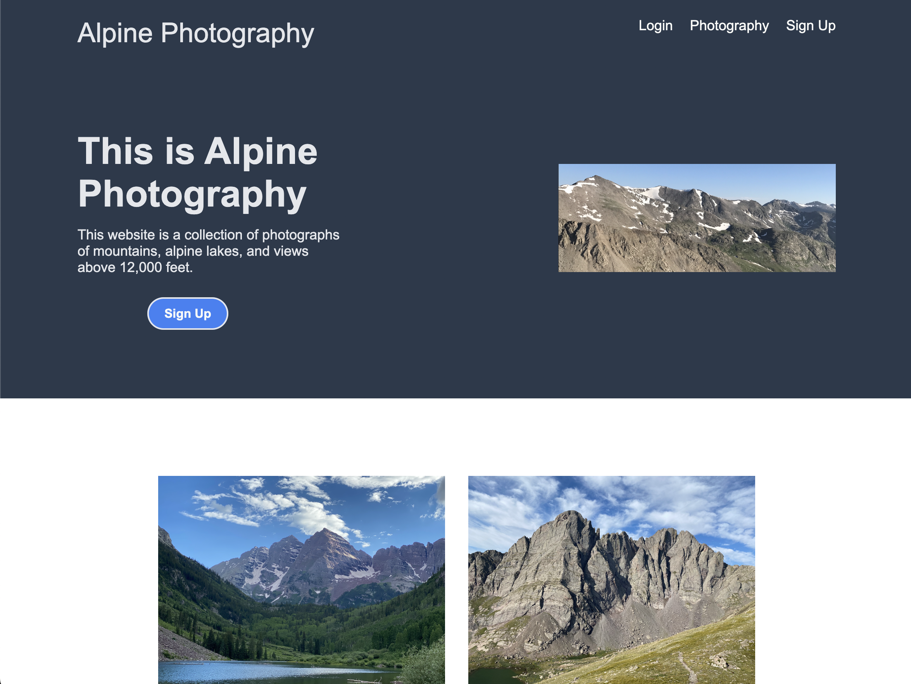
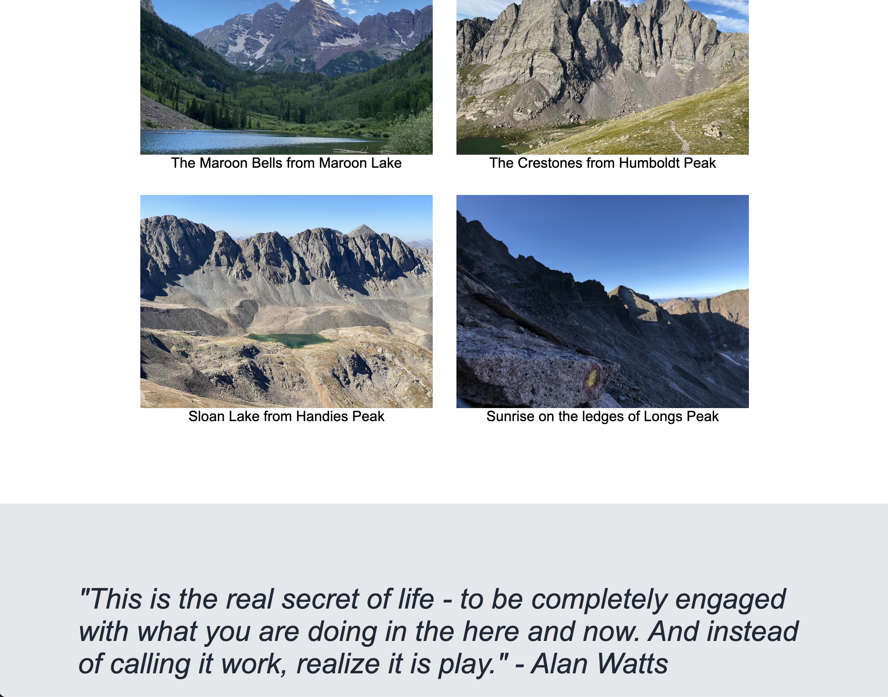

# odin-landing-page
## Project 2: Landing Page Project using CSS, Flex and HTML (The Odin Project)

## Description: 
Welcome to my second web development project! This is part of my coursework in The Odin Project, a free, open-source curriculum to learn fullstack web development! 

This project was built in HTML and CSS. While the project did not require the page to fit in mobile devices, the perfectionist in me will need to come back and fix the CSS so that it looks good on any device. The "sign-up" box in the bottom of the screen also breaks if the window shrinks to a certain size. <!--Remove this section once the mobile view is fixed-->

The task for this project was to build a landing page based off a provided image using CSS Flexbox and HTML. I tried to make this project my own by including a hobby of mine. I hope you enjoy! 

## Photographs: 
All photographs on this project are my own, taken on various hiking trips. 

## Screenshots:

