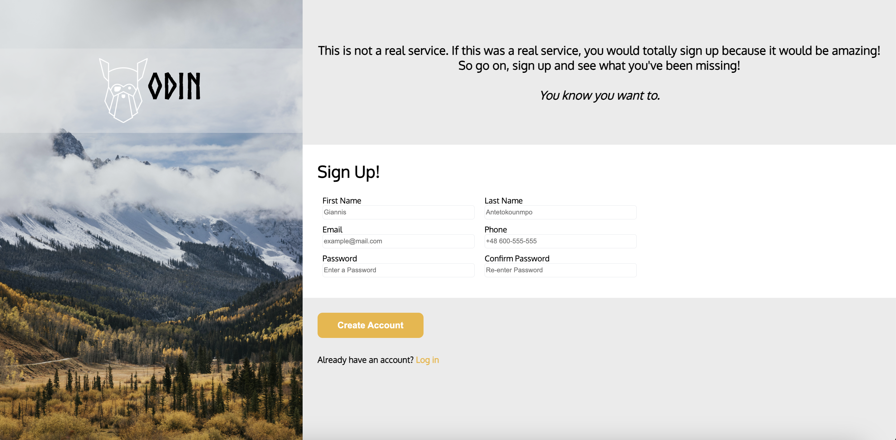
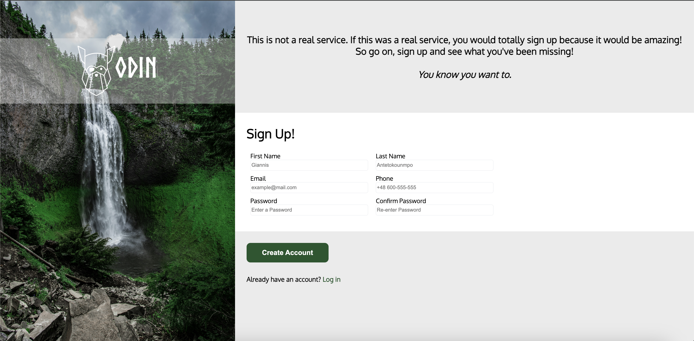

# Sign Up Form
## Project 6.5: Sign Up Form using HTML Forms and CSS (The Odin Project)

## Description: 
Welcome to project number 6.5! This is part of my coursework in The Odin Project, a free, open-source curriculum to learn fullstack web development! 

This project was built in HTML and CSS! 

The task for this project was to build a sign up form. I hope you enjoy! 

## Links:
The full challenge description can be found here: https://www.theodinproject.com/lessons/node-path-intermediate-html-and-css-sign-up-form. 

## Screenshots: 

